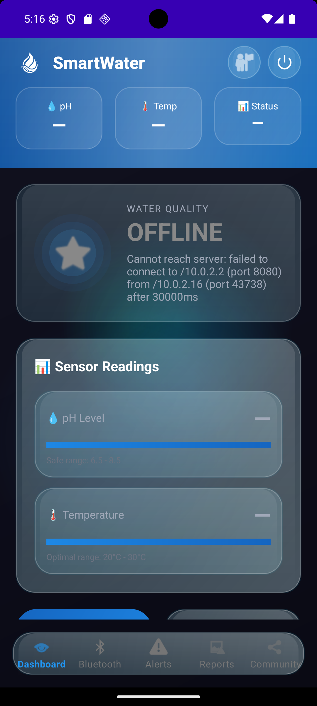
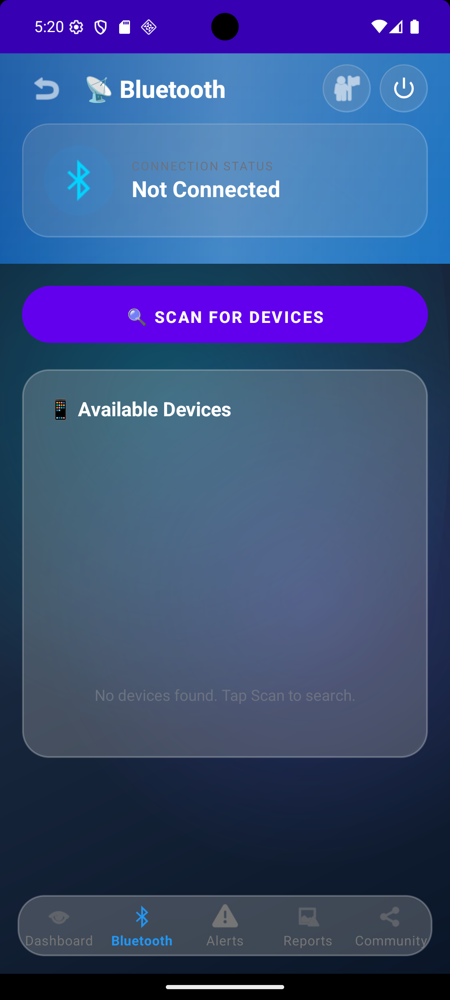
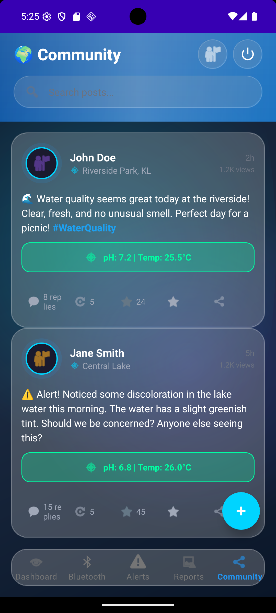
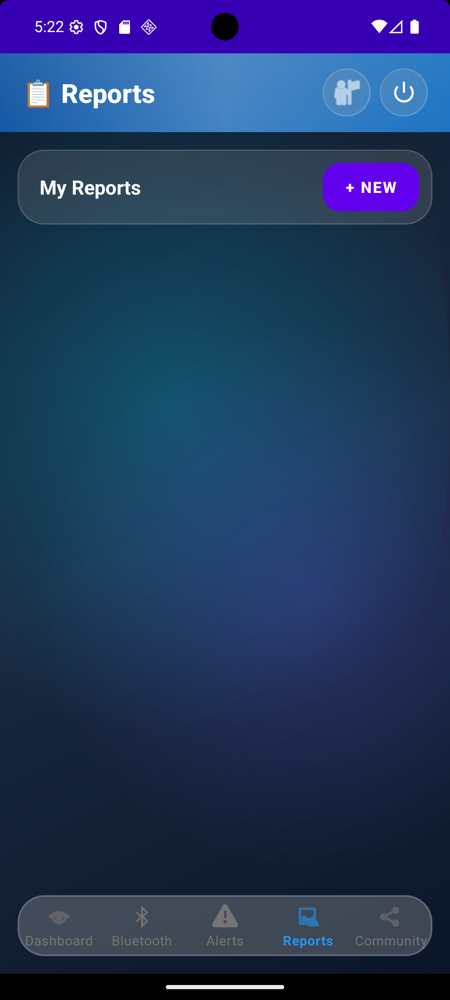
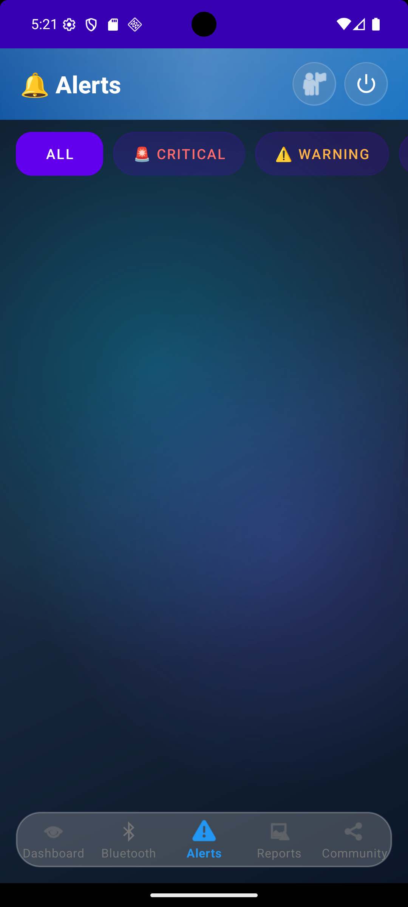

# SmartWater Monitoring App 💧

> A full-stack Android application for **real-time IoT water quality monitoring** — featuring Bluetooth sensor integration, interactive historical charts, GPS pollution reporting, and a Twitter-style community feed.

[](https://developer.android.com)
[](https://android-arsenal.com/api?level=24)
[](https://www.java.com)
[](https://flutter.dev)
[](LICENSE)

---

## Overview

SmartWater connects to IoT water quality sensors via **Bluetooth Classic (RFCOMM/SPP)** and a **Spring Boot REST API** to provide citizens and environmental researchers with a complete water monitoring platform.

The app handles the full IoT pipeline end-to-end: raw Bluetooth byte streams are parsed by a multi-format sensor parser, validated, displayed on a real-time dashboard, and synchronised to a cloud backend — all secured with JWT bearer-token authentication via an OkHttp interceptor.

Beyond sensor monitoring, the app includes GPS-based pollution reporting with Google Maps integration and a Twitter-style community feed for crowdsourced water quality discussion.

> **Note:** This repository contains the Android client and Flutter module only.  
> The Spring Boot REST API and FastAPI sensor service are separate backend components not included here.

---

## Screenshots

### Dashboard


### Bluetooth


### Community Feed


### Pollution Report


### Alerts


---

## Features

### 📊 Real-Time Water Quality Dashboard
- Live pH and temperature readings with **5-second auto-refresh**
- 3-tier quality classification: **SAFE** / **MODERATE** / **POLLUTED** (based on pH thresholds)
- Interactive **MPAndroidChart** line charts with cubic bezier smoothing
- 4 time-range selectors: **1H / 24H / 7D / 30D**
- Pull-to-refresh support

### 🔗 Bluetooth Sensor Integration
- **Bluetooth Classic RFCOMM/SPP** connection with reflection-based fallback for legacy devices
- Multi-format sensor data parser: accepts **key:value pairs**, **CSV**, and **JSON** from the physical sensor
- Parsed readings synced to backend via REST API
- Visual device scan list and connection status tracking

### 🚨 Smart Alerts
- Threshold-based water quality alerts fetched from backend
- **Critical** (red) / **Warning** (orange) severity tiers with filter buttons
- 5-second auto-refresh

### 📝 Pollution Reporting
- **FusedLocationProviderClient** for automatic GPS coordinate detection
- **Geocoder** reverse-coding to human-readable address
- Manual location override via **Google Maps** interactive picker (`MapPickerActivity`)
- Camera capture and gallery image selection with full **Android 13+ permission** handling (`READ_MEDIA_IMAGES`)

### 💬 Community Feed
- Twitter-style social feed: **likes**, **retweets**, **quote tweets**, **replies**, **bookmarks**
- Hashtag highlighting with `SpannableString` + regex (`#word` → coloured inline)
- Sensor badge display (pH / temperature directly on posts)
- Paginated loading, 10-second auto-refresh, pull-to-refresh
- User profiles, follow/unfollow, followers/following lists, bookmarks, search

### 🔐 Authentication
- JWT bearer-token auth via **OkHttp `JwtInterceptor`** — token auto-attached to every API request
- Token persisted in SharedPreferences via `TokenStore`
- User registration + login + profile editing + profile photo upload

### 📱 Flutter Add-to-App Screens
- Second UI layer built in Flutter and embedded via **`FlutterActivity` (Add-to-App pattern)**
- Flutter dashboard shows real-time water quality with glassmorphism UI and animated counters
- Historical data chart using `fl_chart`; state management via `Provider`

---

## Tech Stack

| Layer | Technology | Version |
|-------|-----------|---------|
| **Language** | Java | 1.8 |
| **Platform** | Android SDK | Target 34, Min 24 (Android 7.0+) |
| **UI** | Material Components + ConstraintLayout | 1.11.0 / 2.1.4 |
| **REST Client** | Retrofit 2 + OkHttp | 2.11.0 / 4.12.0 |
| **JSON** | Gson | bundled with Retrofit |
| **Charts** | MPAndroidChart | 3.1.0 |
| **Location** | Google Play Services Location | 21.1.0 |
| **Maps** | Google Maps SDK for Android | 18.2.0 |
| **Bluetooth** | Android SDK BluetoothAdapter (RFCOMM/SPP) | — |
| **Cross-framework** | Flutter Add-to-App | Flutter 3.x |
| **Flutter state** | Provider | 6.1.1 |
| **Flutter charts** | fl_chart | 0.65.0 |
| **Backend** | Spring Boot + FastAPI + PostgreSQL + Redis | External |

---

## Architecture

```
┌─────────────────────────────────────────────────────┐
│              Presentation Layer                      │
│   19 Activities + 2 RecyclerView Adapters           │
│   + Flutter screens (FlutterActivity embedding)     │
└────────────────────┬────────────────────────────────┘
                     │ Retrofit callbacks (UI thread)
┌────────────────────▼────────────────────────────────┐
│              Network Layer                           │
│   ApiClient (Retrofit factory, dynamic base URL)    │
│   7 API interfaces: Auth · Water · Community ·      │
│     Report · Alert · Bluetooth · Follow             │
│   JwtInterceptor (Bearer token on every request)    │
└────────────────────┬────────────────────────────────┘
                     │
┌────────────────────▼────────────────────────────────┐
│              Data Layer                              │
│   21 DTOs (request + response models)               │
│   TokenStore (JWT in SharedPreferences)             │
│   SharedPreferences (profile cache, base URL)       │
└────────────────────┬────────────────────────────────┘
                     │ HTTP/REST
┌────────────────────▼────────────────────────────────┐
│              Backend (External)                      │
│   Spring Boot REST API · FastAPI sensor service     │
│   PostgreSQL · Redis                                │
└─────────────────────────────────────────────────────┘

Bluetooth (dedicated package, separate from network):
BluetoothConnectionManager ──► ConnectionCallback
  ConnectThread  (RFCOMM socket + reflection fallback)
  ConnectedThread (read loop + multi-format parser)
  → Handler.post() dispatches parsed data to UI thread
```

---

## Repository Structure

```
SmartWater Monitoring App/
├── SmartWaterMonitoringApp/      Android app (Java, SDK 34)
│   └── app/src/main/
│       ├── java/                 52 source files
│       │   ├── *.java            19 Activities
│       │   ├── adapter/          2 RecyclerView adapters
│       │   ├── bluetooth/        BluetoothConnectionManager (RFCOMM/SPP)
│       │   └── network/          ApiClient · 7 API interfaces · JwtInterceptor
│       │       └── dto/          21 DTO classes
│       └── res/                  26 layouts · 51 drawables · themes
│
└── smartwater_flutter/           Flutter Add-to-App module (Dart)
    └── lib/
        ├── config/               AppConfig (server IP, thresholds, endpoints)
        ├── models/               WaterQualityData · HistoryResponse
        ├── providers/            WaterQualityProvider (state management)
        ├── screens/              Dashboard · History · Splash · Home
        ├── services/             ApiService (HTTP client)
        ├── theme/                Design tokens
        └── widgets/              GlassCard · ParameterCard · StatusBanner
```

---

## Prerequisites

- **Android Studio** (Hedgehog / Iguana or later)
- **JDK 8+**  
- **Flutter SDK** (3.x) — only needed if modifying the Flutter module
- A running **SmartWater Spring Boot** backend on port `8080`
- A running **FastAPI** sensor service on port `8888` (for Bluetooth data ingestion)
- A **Google Maps API key** with Maps SDK for Android enabled

---

## Getting Started

### 1. Clone the repository
```bash
git clone https://github.com/YOUR_USERNAME/smartwater-monitoring-app.git
cd smartwater-monitoring-app
```

### 2. Configure secrets in `local.properties`

Create `SmartWaterMonitoringApp/local.properties` (this file is gitignored and never committed):
```properties
# Android SDK path — auto-set by Android Studio, adjust if needed
sdk.dir=/path/to/your/Android/Sdk

# Google Maps API key (Maps SDK for Android)
# Get one at: https://console.cloud.google.com/apis/credentials
MAPS_API_KEY=your_google_maps_api_key_here
```

### 3. Set your backend server IP

**Android app** — the default URL is `http://10.0.2.2:8080/` (Android emulator loopback pointing to your host machine). For a real device on LAN, either use the in-app settings screen at runtime, or update the constant:
```java
// network/ApiClient.java
public static final String DEFAULT_BASE_URL = "http://YOUR_SERVER_IP:8080/";
```

**Flutter module** — edit `smartwater_flutter/lib/config/app_config.dart`:
```dart
static const String serverIP = 'YOUR_SERVER_IP'; // replace with your LAN IP
```

### 4. Open and run the Android project

Open `SmartWaterMonitoringApp/` in Android Studio, then run on an emulator or physical device (API 24+).

### 5. (Optional) Run the Flutter module standalone

```bash
cd smartwater_flutter
flutter pub get
flutter run
```

---

## Key Components

| File | Lines | Purpose |
|------|------:|---------|
| `DashboardActivity.java` | 728 | Real-time sensor display, MPAndroidChart, 5 s auto-refresh |
| `BluetoothConnectionManager.java` | 476 | RFCOMM socket, data streaming, multi-format parser |
| `CommunityActivity.java` | 641 | Twitter-style feed, like/reply/RT with backend sync |
| `SubmitReportActivity.java` | 539 | GPS form, camera, Google Maps location picker |
| `ApiClient.java` | 225 | Retrofit factory — dynamic URL + 7 API services |
| `JwtInterceptor.java` | 37 | Bearer token injection on all outgoing HTTP requests |

---

## Permissions

| Permission | Reason |
|---|---|
| `INTERNET` | API calls to Spring Boot backend |
| `BLUETOOTH` / `BLUETOOTH_ADMIN` | Classic Bluetooth scan and pairing |
| `BLUETOOTH_SCAN` / `BLUETOOTH_CONNECT` | Bluetooth permissions for Android 12+ |
| `ACCESS_FINE_LOCATION` / `ACCESS_COARSE_LOCATION` | GPS for pollution reports |
| `CAMERA` | Photo attachment for pollution reports |
| `READ_MEDIA_IMAGES` | Gallery access on Android 13+ |
| `POST_NOTIFICATIONS` | Alert notifications on Android 13+ |

---

## Known Limitations

- The Spring Boot backend, FastAPI sensor service, and database are **not included** in this repository. This repo is the Android client + Flutter module only.
- Google Maps requires a valid API key in `local.properties` — the map view will not render without one.
- Bluetooth sensor communication requires a physical device paired with a compatible water quality sensor over SPP/RFCOMM.
- The app uses `cleartext traffic` (`android:usesCleartextTraffic="true"`) for local development. For a production deployment, enable HTTPS on the backend and remove this flag.

---

## License

This project is licensed under the MIT License — see the [LICENSE](LICENSE) file for details.
